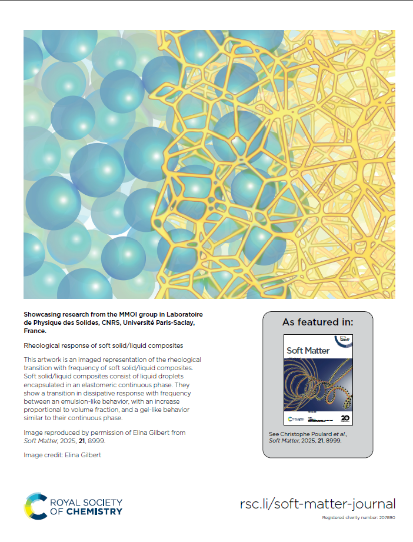

I am extremely pleased to announce I had the opportunity to draw a back cover to accompany my paper in Soft Matter!
<!--more-->

The paper is in open access for the next few days, so jump on the occasion to read it here! [DOI: 10.1039/D5SM00973A](https://pubs.rsc.org/en/Content/ArticleLanding/2025/SM/D5SM00973A)

